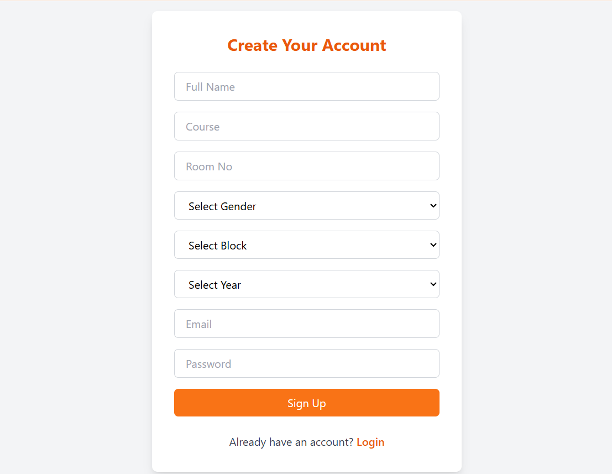
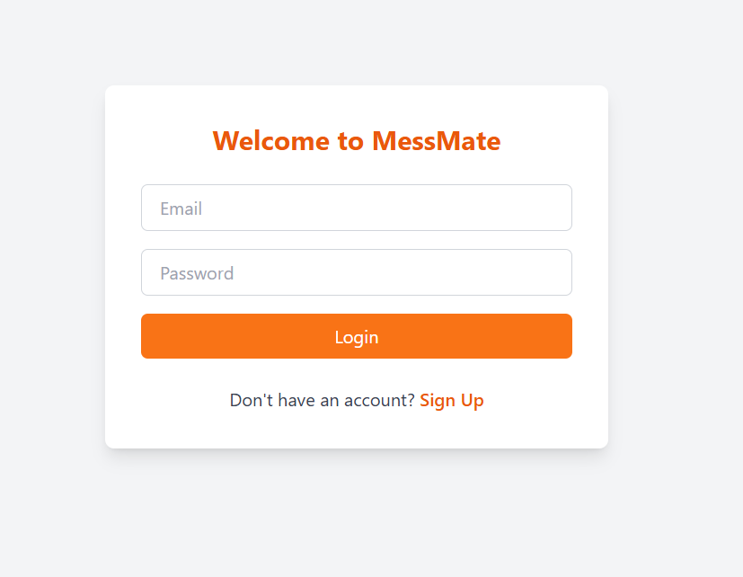
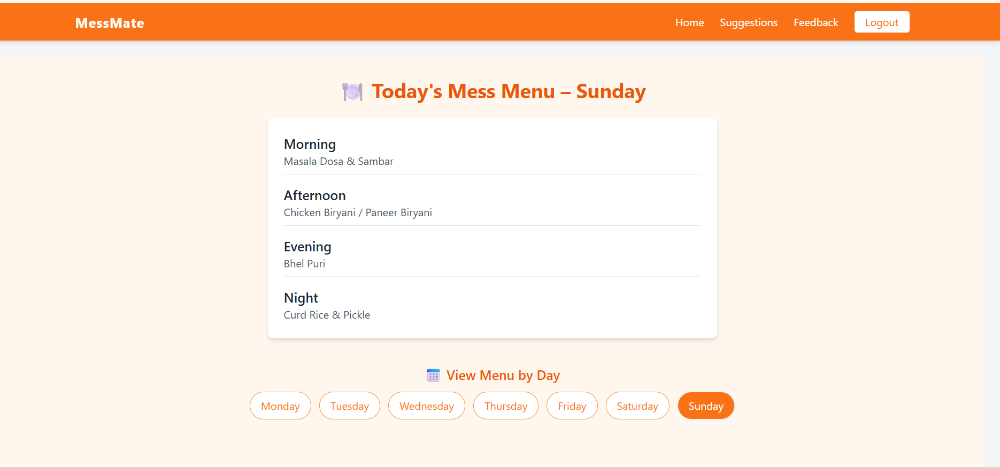
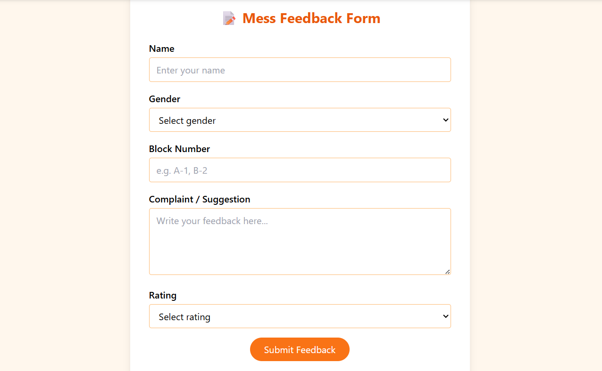

# 🍽️ MessMate – Smart Hostel Mess Menu Web App

MessMate is a modern, responsive web application built for hostel students to view the daily menu, give feedback, and get healthy food suggestions using Google Gemini AI.  

This is a prototype built using **React**, **Firebase**, **Tailwind CSS**, and **Gemini API** on **Google IDX / Firebase Studio** platforms.

---

## 🚀 Features

- 🔐 **Login / Signup**: Firebase Authentication (email/password)
- 🏠 **Homepage**: Displays today's mess menu (morning, lunch, snacks, dinner)
- ✨ **AI Suggestions**: Gemini-powered healthy food suggestions (with images & food links)
- 📝 **Feedback Form**: Students can submit complaints and rate food taste
- 🚪 **Logout**: Secure session management
- 📱 **Responsive UI**: Mobile-friendly and eye-catching Tailwind design

---

## 🧠 Technologies Used

| Tech         | Description                               |
|--------------|-------------------------------------------|
| ⚛️ React      | Frontend UI framework                    |
| 🔥 Firebase   | Authentication + (Optional: Firestore)   |
| 🎨 Tailwind CSS | For fast and beautiful styling          |
| 🤖 Gemini API | Google Generative AI for food suggestions |
| 🌐 Google IDX | Cloud development & hosting platform     |

---

## 📸 Screenshots









---


### 1. Clone the Repository

```bash
git clone https://github.com/your-username/messmate.git


📈 Future Improvements
📊 Admin dashboard with menu editor & feedback analytics

📣 Notification system for special items or timings

🗳️ Poll system for dish voting

🌓 Dark mode toggle

📄 Menu download as PDF


